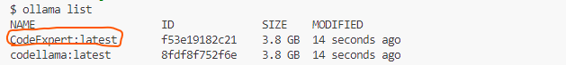

https://ai.meta.com/blog/code-llama-large-language-model-coding/

https://ollama.com/download

https://github.com/ollama/ollama

## Instructions

    conda create -p venv python=3.12.1 -y
    conda activate venv/
    pip install -r requirements.txt

## Create Custom model using codellama and verify

    ollama create CodeExpert -f custom_model
 
  

## Play with newly created custom model in command line
    ollama run CodeExpert

## Integration with UI

    python app.py # Make sure ollaam run CodeExpert is running. This will expose a api